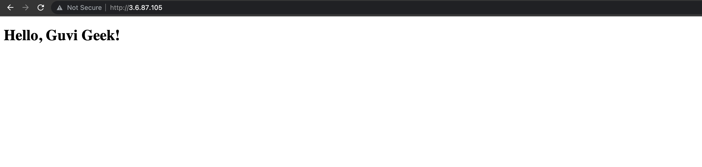
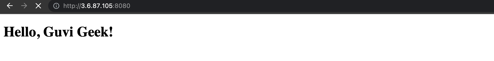

# GUVI-assignment
<b> Step 1:  Create a small web application using AWS EC2 </b> \
a.  Launch an EC2 instance: \
    Click on "Launch Instance" on AWS Console to create a new EC2 instance. \
    Using Amazon Machine Image (AMI), create a t2 micro instance with least configurations.\
    Create security group that allows inbound traffic on port 80 (HTTP) or port 443 (HTTPS) to access your web app. \
    Connect to your EC2 instance: 

b. Install a web server: \
    Install Apache web server by running the following command:<code> sudo yum install httpd -y </code> \
    Start the Apache service: <code> sudo service httpd start. </code> \
    Enable Apache to start on system boot: <code> sudo chkconfig httpd on </code>

c. Create a simple HTML file (index.html): \
    Change to the web server's root directory: cd /var/www/html \
    Create a new HTML file: Create a new HTML file: \
    index.html file is attached in the root directory. \
     

<b> Step 2: Containerising the application </b> \
    Install Docker on the EC2 instance: \
    Update the package repository and install the required dependencies: <code> sudo yum update -y && sudo yum install -y docker </code> \
    Created the Dockerfile (in the project directory) \
    In the EC2 instance, navigate to the directory where the Dockerfile is located  (/home/ec2-user). \
    Build the Docker image: <code> docker build -t hello-world-app . </code> \
    Run the Docker container using the image you just built: <code> docker run -d -p 8080:80 hello-world-app </code> \
    You can then access the web app by navigating to http://<EC2_INSTANCE_PUBLIC_IP>:8080 in your web browser. \
    The application also runs on port 8080 after this step: 
    

<b> Also i pushed this image to Dockerhub : https://hub.docker.com/r/divyashukla23/guvi_devops1 </b>

<b> Step 3: Creating Jenkins pipeline for this application </b> \

 

